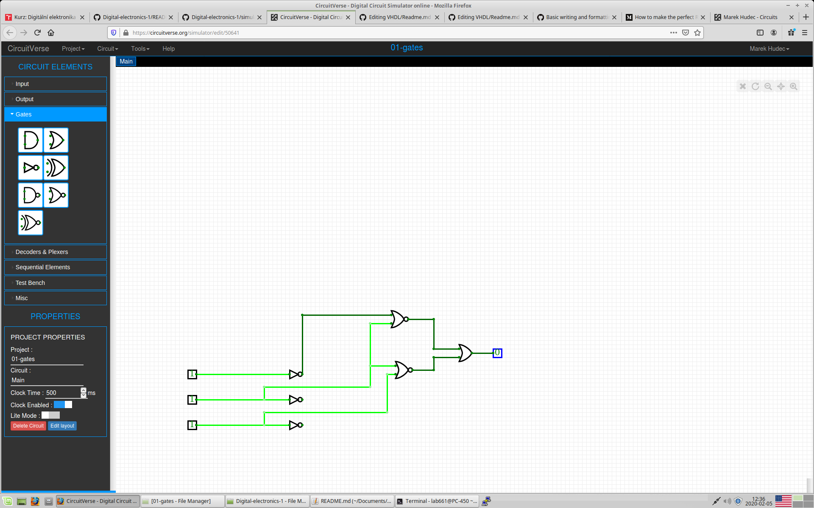

## Online simulator

1. Use online digital circuit simulator [CircuitVerse](https://circuitverse.org/), launch the simulator, draw and verify basic two-input logic gates.

2. Run any text editor, such as Visual Studio Code, open `Digital-electronics-1/Labs/01-gates/README.md` file, create/complete tables with logical values, and add a screenshot from the simulator.

    

    | **A** | **NOT** |
    | :-: | :-: |
    | 0 | 1 |
    | 1 | 0 |

    | **A** | **B** | **AND** | **NAND** |
    | :-: | :-: | :-: | :-: |
    | 0 | 0 | 0 | 1 |
    | 0 | 1 | 0 | 1 |
    | 1 | 0 | 0 | 1 |
    | 1 | 1 | 1 | 0 |

    | **A** | **B** | **OR** | **NOR** |
    | :-: | :-: | :-: | :-: |
    | 0 | 0 | 0 | 1 |
    | 0 | 1 | 1 | 0 |
    | 1 | 0 | 1 | 0 |
    | 1 | 1 | 1 | 0 |

    | **A** | **B** | **XOR** | **XNOR** |
    | :-: | :-: | :-: | :-: |
    | 0 | 0 | 0 | 1 |
    | 0 | 1 | 1 | 0 |
    | 1 | 0 | 1 | 0 |
    | 1 | 1 | 0 | 1 |
Use online simulator and verify De Morgan's laws.

   

    
    | **A** | **B** |**C** | 
    | :-: | :-: | :-: | :-: | :-: | :-: |
    | 0 | 0 | 0 | 1 | 1 | 1 |
    | 0 | 0 | 1 | 0 | 0 | 0 |
    | 0 | 1 | 0 | 0 | 0 | 0 |
    | 0 | 1 | 1 | 0 | 0 | 0 |
    | 1 | 0 | 0 | 1 | 1 | 1 |
    | 1 | 0 | 1 | 1 | 1 | 1 |
    | 1 | 1 | 0 | 0 | 0 | 0 |
    | 1 | 1 | 1 | 1 | 0 | 0 |

