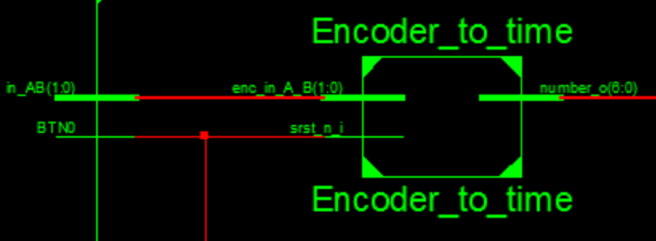

## Vysoké učení technické v Brně
### Fakulta eletrotechniky a komunikaních technologií
#### Digitální elektronika 1
##### Projekt
PWM Stmívač
======

Tento projekt se zabývá řešením **PWM stmívače** s nastavitelnou dobou "načasování" s **rotačním enkodérem KY-040 s tlačítkem.**

Níže jest tento projekt rozdělen do jednotlivých částí s odkazy na dílčí soubory, screenshoty jednotlivých průběhů aplikace a dále odkazy na datasheete a jiné užitečné informace.

 ##      **Kompletní projekt**
 
 Výsledný výtvor sestává z jednotlivých bloků (modulů), které byly vytvořeny, následně propojeny a odsimulovány ke správné funkčnosti zadaného projektu.
 [PWM stmívač s nastavitelnou dobou "načasování s rotačním enkodérem KY-040 s tlačítkem](https://github.com/marekhudec/Digital-electronics1/blob/master/Labs/09-Project/schema.png)
 - **Enkodér KY-040**
 - **Encoder_to_time**
 - **Clock_enable**
 - **Delay**
 - **PWM**
 
 

### Enkodér KY-040
Rotační enkodér s tlačítkem (modul KY-040) jest velmi přesná pomocná jednotka, u které je, oproti potenciometru, zajištěna přesnost kroků, a sice při každém otočení "cvaknou" zoubky uvnitř tohoto enkodéru, tudíž je snadno spočítat, kolik kroků bylo provedeno. Zmínění enkodér má rozsah 20 kroků s možností uložení (pomocí tlačítka) viz [Datasheet Rotary Encoder KY-040](https://www.handsontec.com/dataspecs/module/Rotary%20Encoder.pdf) 
Enkodérem je nastaveno 

### Encoder_to_time

