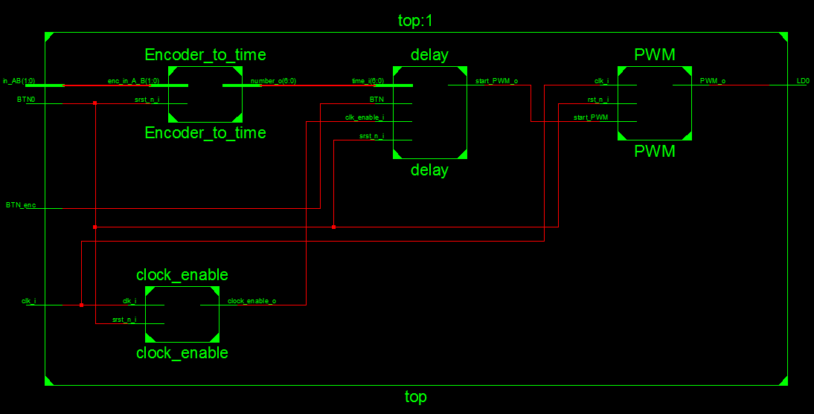
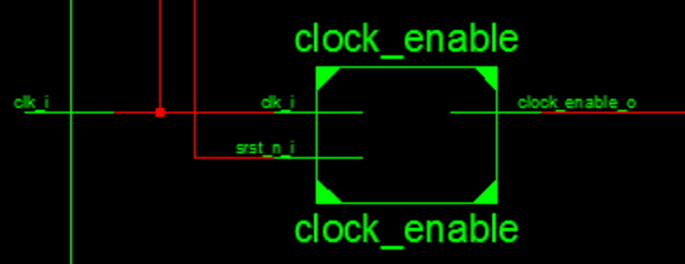
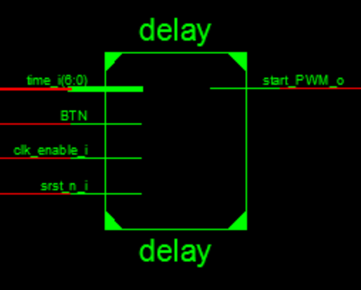
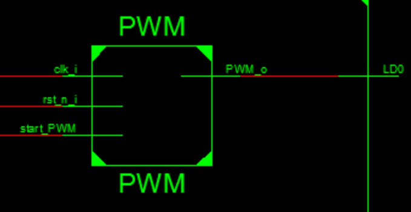

## Vysoké učení technické v Brně
### Fakulta eletrotechniky a komunikaních technologií
#### Digitální elektronika 1
##### Projekt
PWM Stmívač
======

Tento projekt se zabývá řešením **PWM stmívače** s nastavitelnou dobou "načasování" s **rotačním enkodérem KY-040 s tlačítkem.**

Níže jest tento projekt rozdělen do jednotlivých částí s odkazy na dílčí soubory, screenshoty jednotlivých průběhů aplikace a dále odkazy na datasheete a jiné užitečné informace.

 ##      **Kompletní projekt**
 
 Výsledný výtvor sestává z jednotlivých bloků (modulů), které byly vytvořeny, následně propojeny a odsimulovány ke správné funkčnosti zadaného projektu.
 
 
 
     Celkové schéma zapojení: k Encoder_to_time se připojuje Enkodér KY-040. Vrstva top má vyvedení vstup pro tlačítko enkodéru, kterým se spouští časování. Funkce resetování celého bloku jest připojena na tlačítko BTN0.
 
 
 - **Enkodér KY-040**
 - **Encoder_to_time**
 - **Clock_enable**
 - **Delay**
 - **PWM**
 
 

### Enkodér KY-040
*Rotační enkodér s tlačítkem (modul KY-040)* jest velmi přesná pomocná jednotka, u které jest, oproti potenciometru, zajištěna přesnost kroků, a sice při každém otočení "cvaknou" zoubky uvnitř tohoto enkodéru, tudíž je snadno spočítat, kolik kroků bylo provedeno. Zmínění enkodér má rozsah 20 kroků s možností uložení (pomocí tlačítka) viz [Datasheet Rotary Encoder KY-040](https://www.handsontec.com/dataspecs/module/Rotary%20Encoder.pdf) 
Enkodérem je nastaveno časování (inkrementace/dekrementace). Hodnota jednoho kroku jest 10 ms.

### Encoder_to_time

*Encoder_to_time* jest převodník z binární hodnoty z výstupu enkodéru KY-040 na kladné celé číslo (hodnotu) viz [Encoder_to_time.vhd](https://github.com/marekhudec/Digital-electronics1/blob/master/Labs/09-Project/Encoder_to_time.vhd) a [Encoder_to_time_tb.vhd](https://github.com/marekhudec/Digital-electronics1/blob/master/Labs/09-Project/Encoder_to_time_tb.vhd)

### Clock_enable

*Clock_enable* jest předděličkou kmitočtu. Zajišťuje snížení frekvence řídícího (hodinového) signálu, a sice 100 krát viz [Clock_enable.vhd](https://github.com/marekhudec/Digital-electronics1/blob/master/Labs/09-Project/clock_enable.vhd)

### Delay

*Delay* jest čítač, který zajišťuje "načasování" spuštění procesu PWM viz [Delay.vhd](https://github.com/marekhudec/Digital-electronics1/blob/master/Labs/09-Project/delay.vhd), [Delay_tb.vhd](https://github.com/marekhudec/Digital-electronics1/blob/master/Labs/09-Project/delay_tb.vhd) a viz simulace [Delay_sim.png](https://github.com/marekhudec/Digital-electronics1/blob/master/Labs/09-Project/delay_sim.png).

### PWM

*PWM* jest proces, který zajišťuje postupné snižování střední hodnoty výstupního signálu (napětí) až k 0 (0V) pomocí změny šířky pulzů.
Jeho výstup jest připojen na LED diodu, kterou stmívá viz [PWM.vhd](https://github.com/marekhudec/Digital-electronics1/blob/master/Labs/09-Project/PWM.vhd), [PWM_tb.vhd](https://github.com/marekhudec/Digital-electronics1/blob/master/Labs/09-Project/PWM_tb.vhd) a viz simulace [PWM_sim1.png](https://github.com/marekhudec/Digital-electronics1/blob/master/Labs/09-Project/PWM_sim1.png) a [PWM_sim2.png](https://github.com/marekhudec/Digital-electronics1/blob/master/Labs/09-Project/PWM_sim2.png)

## Top

*Top* vrstva jest implementována na CoolRunner-II CPLD starter board.

